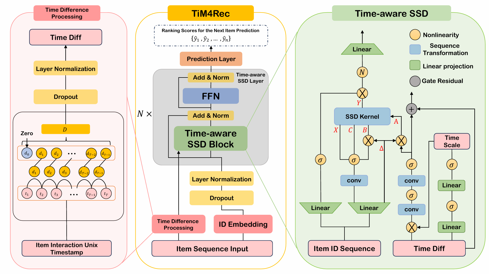

# TiM4Rec: An Efficient Sequential Recommendation Model Based on Time-Aware Structured State Space Duality Model

[//]: # (Paperwithcode is no longer available)
[//]: # ([![PWC]&#40;https://img.shields.io/endpoint.svg?url=https://paperswithcode.com/badge/tim4rec-an-efficient-sequential/sequential-recommendation-on-movielens-1m&#41;]&#40;https://paperswithcode.com/sota/sequential-recommendation-on-movielens-1m?p=tim4rec-an-efficient-sequential&#41;)

[//]: # ([![PWC]&#40;https://img.shields.io/endpoint.svg?url=https://paperswithcode.com/badge/tim4rec-an-efficient-sequential/sequential-recommendation-on-kuairand&#41;]&#40;https://paperswithcode.com/sota/sequential-recommendation-on-kuairand?p=tim4rec-an-efficient-sequential&#41;)

[//]: # ([![PWC]&#40;https://img.shields.io/endpoint.svg?url=https://paperswithcode.com/badge/tim4rec-an-efficient-sequential/sequential-recommendation-on-amazon-beauty&#41;]&#40;https://paperswithcode.com/sota/sequential-recommendation-on-amazon-beauty?p=tim4rec-an-efficient-sequential&#41;)


~~Due to the laboratory regulations, the article has not been officially published before the model source code is not allowed to be published,
so the current repository is not complete, but do not worry, we will supplement the complete model code immediately after the article is officially published.
You can also first check the performance of the **TiM4Rec** model by using the training log files we published. 😊~~

**Update:** 🎉 TiM4Rec Accepted by *Neurocomputing!*, We've open-sourced the full model code as promised!

---

如果您想阅读中文版本，请点击[README_CN.md](README_CN.md) 。
## 1. Introduction
  <p align="center">
    
  </p>

> **TiM4Rec: An Efficient Sequential Recommendation Model Based on Time-Aware Structured State Space Duality Model**\
> Hao Fan, Mengyi Zhu, Yanrong Hu, Hailin Feng, Zhijie He, Hongjiu Liu, Qingyang Liu\
> Paper: https://doi.org/10.1016/j.neucom.2025.131270 (***⚠️ Limited-Time Free Access: Thanks to Elsevier's share link, the publisher's version is free to read and download until October 12, 2025. Access it here [Limited time license](https://authors.elsevier.com/c/1lelB3INukW9mV)***) \
> Preprint: https://arxiv.org/abs/2409.16182

We propose ***TiM4Rec***(Time-aware Mamba For Recommendation), an efficient sequential recommendation model based on Time-aware SSD. 
We conducted a pioneering exploration of the time-aware enhancement methods of the Mamba architecture in the field of sequential recommendation. 
Through an in-depth analysis of SSM and SSD, we propose, for the first time, a time-aware enhancement method with linear computational complexity that is applicable to the SSD architecture. 


In the following, we will guide you how to use this repository step by step. 🤗

## 2. Preparation
```shell
git clone https://github.com/AlwaysFHao/TiM4Rec.git
cd TiM4Rec/
```

### 2.1 Environment Requirements
The following are the main runtime environment dependencies for running the repository：
- cuda 11.8
- python 3.10.14
- pytorch 2.3.0
- recbole 1.2.0
- mamba-ssm 2.2.2
- casual-conv1d 1.2.2 (Since we implemented the casual-conv1d equivalent using 'nn.Conv1d', this entry is optional)
- psutil 6.1.0
- numpy 1.26.4

If you are having trouble installing Mamba, please refer to the installation tutorial we wrote: [https://github.com/AlwaysFHao/Mamba-Install](https://github.com/AlwaysFHao/Mamba-Install).

You can also view detailed environment information in File [environment.yaml](environment.yaml).

### 2.2 DataSets
This work utilizes the following four datasets, among which [`🎦 MovieLens-1M`](https://grouplens.org/datasets/movielens/), [`🛒 Amazon-Beauty`](https://jmcauley.ucsd.edu/data/amazon/index_2014.html) and [`🎮 Steam`](https://recbole.s3-accelerate.amazonaws.com/ProcessedDatasets/Steam/not-merged/steam.zip) datasets are provided by [RecBole](https://github.com/RUCAIBox/RecSysDatasets), [`📱 KuaiRand`](https://kuairand.com/) dataset is provided by the author of [SSD4Rec](https://arxiv.org/abs/2409.01192). 

All dataset files can be obtained from the cloud storage: [Quark Drive (password: **SVzs**)](https://pan.quark.cn/s/8bb746acc798) / [BaiDu Cloud Drive (password: **1296**)](https://pan.baidu.com/s/10GUBfkdqd7iPiXTw5ulQtA?pwd=1296) / [Google Drive](https://drive.google.com/drive/folders/11_tqDeG5oA4c6Bz7tjgEnMTeI6BbnCUr?usp=sharing). 

- [`🎦 MovieLens-1M`](https://grouplens.org/datasets/movielens/): A dataset containing approximately 1 million user ratings for movies, collected from the MovieLens platform.
- [`🛒 Amazon-Beauty`](https://jmcauley.ucsd.edu/data/amazon/index_2014.html): The user review dataset collected in the beauty category on the Amazon platform was compiled up to the year 2014. 
- [`📱 KuaiRand`](https://kuairand.com/): Acquired from the recommendation logs of the application KuaiShou, the dataset includes millions of interactions involving items that were randomly displayed.
- [`🎮 Steam`](https://recbole.s3-accelerate.amazonaws.com/ProcessedDatasets/Steam/not-merged/steam.zip): The dataset collected by Kang et al. (SASRec authors) consists of user ratings from the Steam platform spanning from 2010 to 2018, which has been widely adopted as an evaluation benchmark in prior work. 

### 2.3 Project Structure
In this section, you can learn about our project structure. 

You can click on the directory below to expand and view the project structure: 

<details><summary>📁 TiM4Rec</summary>
<ul>
    <li>📁 assert | (Store readme related images) </li>
    <li>📁 baseline | (The baseline model is covered in the paper) </li>
    <ul>
        <li>📁 BERT4Rec</li>
        <ul>
            <li>📜 config.yaml</li>
            <li>🐍 run.py</li>
        </ul>
        <li>📁 ...</li>
    </ul>
    <li>📁 config | (Configuration file for TiM4Rec model) </li>
    <ul>
        <li>📜 config4beauty_64d.yaml</li>
        <li>📜 config4kuai_64d.yaml</li>
        <li>📜 config4movie_64d.yaml</li>
        <li>📜 config4movie_256d.yaml</li>
    </ul>
    <li>📁 dataset | (Store dataset files) </li>
    <ul>
        <li>📁 amazon-beauty</li>
        <ul>
            <li>📖 amazon-beauty.inter</li>
            <li>📖 amazon-beauty.item</li>
        </ul>
        <li>📁 ... </li>
    </ul>
    <li>📁 log | (Training log file)</li>
    <li>📁 log_tensorboard | (Training log file of tensorboard)</li>
    <li>📁 saved | (Saved model weight file)</li>
    <li>📜 environment.yaml</li>
    <li>🐍 run.py</li>
    <li>🐍 ssd.py</li>
    <li>🐍 test.py</li>
    <li>🐍 tim4rec.py</li>
</ul>
</details>

You can download files from the cloud storage and put them in the corresponding folder. [Quark Drive (password: **SVzs**)](https://pan.quark.cn/s/8bb746acc798) / [BaiDu Cloud Drive (password: **1296**)](https://pan.baidu.com/s/10GUBfkdqd7iPiXTw5ulQtA?pwd=1296) / [Google Drive](https://drive.google.com/drive/folders/11_tqDeG5oA4c6Bz7tjgEnMTeI6BbnCUr?usp=sharing).

## 3. Run
Ok, congratulations 🎇, you have finished all the preparation 👍, let's start training the model! 😄 

This section will introduce the training methods of the model. 

**Note:** *Since the SSD kernel is implemented with Triton and includes auto-tuning, the model requires a warm-up during the first iteration. Please record the actual runtime of TiM4Rec starting from the second epoch(refer to [Mamba2 Author's Answer](https://github.com/state-spaces/mamba/issues/389#issuecomment-2171755306)).*

### 3.1 TiM4Rec
After preparing all the necessary files and runtime environment, please modify the configuration file path in [`🐍 run.py`](run.py) in the following format:
```python
config = Config(model=TiM4Rec, config_file_list=['config/config4{dataset_name}_{dim}d.yaml'])
```
Just run it directly：
```shell
python run.py
```
If you want to continue checkpoint training, you need to add the model weight path to the `checkpoint_path` configuration item in the corresponding configuration file. 
```yaml
checkpoint_path: saved/model_weight_name.pth
```

### 3.2 Baseline(Optional)
You can directly select the baseline model we have organized in the [`📁 baseline`](baseline) folder for training, taking `SASRec` as an example.
```shell
cd ./baseline/SASRec
python run.py
```
### 3.3 Model testing
If you want to directly test the performance of a specified model weight, you can refer to the method in section [3.1](#31-tim4rec), modify the configuration file name in the [`🐍 test.py`](test.py) file and add the `checkpoint_path` item in the corresponding configuration file, and then perform the test:
```shell
python test.py
```

## 4. Acknowledgements
Our code implementation is based on the [RecBole](https://github.com/RUCAIBox/RecBole) and [Pytorch](https://github.com/pytorch/pytorch) frameworks, and references the work of [Mamba4Rec](https://github.com/chengkai-liu/Mamba4Rec) and [Mamba](https://github.com/state-spaces/mamba). 
The replication of the baseline model is referenced from [TiSASRec.pytorch](https://github.com/pmixer/TiSASRec.pytorch) and [LRURec](https://github.com/yueqirex/LRURec). 
In addition, our readme document was written with reference to [MISSRec](https://github.com/gimpong/MM23-MISSRec).

## 5. References
If you find this code useful or use the toolkit in your work, please consider citing:

```
@article{fan2025tim4rec,
  title = {TiM4Rec: An efficient sequential recommendation model based on time-aware structured state space duality model},
  author = {Hao Fan and Mengyi Zhu and Yanrong Hu and Hailin Feng and Zhijie He and Hongjiu Liu and Qingyang Liu},
  journal = {Neurocomputing},
  volume = {654},
  pages = {131270},
  year = {2025},
  issn = {0925-2312},
  doi = {https://doi.org/10.1016/j.neucom.2025.131270},
  url = {https://www.sciencedirect.com/science/article/pii/S0925231225019423},
  keywords = {Sequential recommendation, State space model (SSM), State space duality (SSD), Mamba, Time-awareness},
}
```

```
@misc{fan2024tim4rec,
  title={TiM4Rec: An Efficient Sequential Recommendation Model Based on Time-Aware Structured State Space Duality Model},
  author = {Hao Fan and Mengyi Zhu and Yanrong Hu and Hailin Feng and Zhijie He and Hongjiu Liu and Qingyang Liu},
  journal = {CoRR},
  volume = {abs/2409.16182},
  year = {2024},
  doi = {10.48550/ARXIV.2409.16182},
  eprinttype = {arXiv},
  eprint = {2409.16182},
  timestamp = {Wed, 16 Oct 2024 13:28:37 +0200},
  archivePrefix="arXiv"
}
```