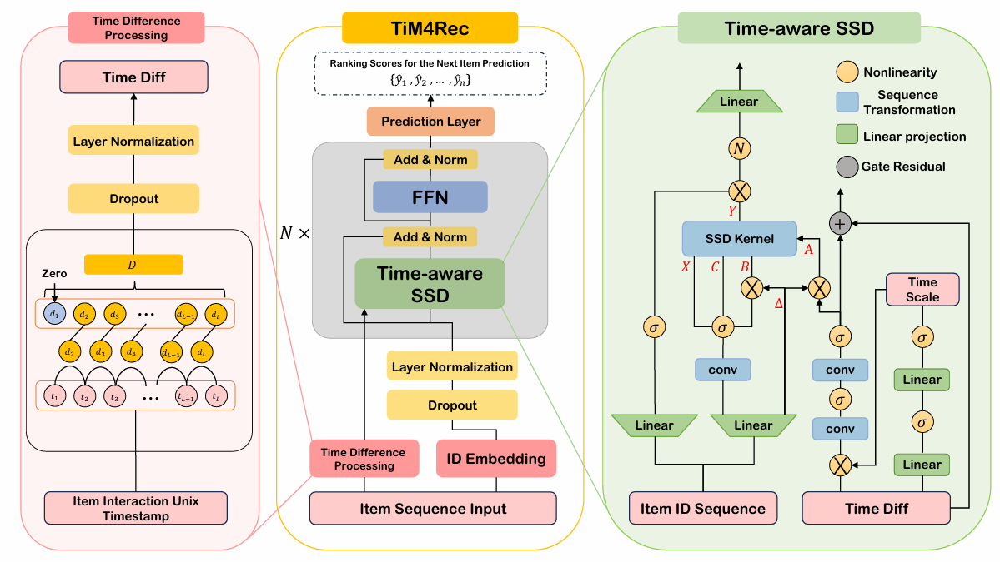

# TiM4Rec: An Efficient Sequential Recommendation Model Based on Time-Aware Structured State Space Duality Model

[//]: # (Paperwithcode is no longer available)
[//]: # ([![PWC]&#40;https://img.shields.io/endpoint.svg?url=https://paperswithcode.com/badge/tim4rec-an-efficient-sequential/sequential-recommendation-on-movielens-1m&#41;]&#40;https://paperswithcode.com/sota/sequential-recommendation-on-movielens-1m?p=tim4rec-an-efficient-sequential&#41;)

[//]: # ([![PWC]&#40;https://img.shields.io/endpoint.svg?url=https://paperswithcode.com/badge/tim4rec-an-efficient-sequential/sequential-recommendation-on-kuairand&#41;]&#40;https://paperswithcode.com/sota/sequential-recommendation-on-kuairand?p=tim4rec-an-efficient-sequential&#41;)

[//]: # ([![PWC]&#40;https://img.shields.io/endpoint.svg?url=https://paperswithcode.com/badge/tim4rec-an-efficient-sequential/sequential-recommendation-on-amazon-beauty&#41;]&#40;https://paperswithcode.com/sota/sequential-recommendation-on-amazon-beauty?p=tim4rec-an-efficient-sequential&#41;)


~~由于实验室规定，文章未正式发表前不允许公布模型源代码，所以目前的资源库还不完整，不过您不用担心，文章正式发表后我们会立即补充完整的模型代码。
您也可以先使用我们发布的训练日志文件检查**TiM4Rec**模型的性能。😊~~

**更新：** 🎉 TiM4Rec已被*Neurocomputing*录用！ 我们已经按照承诺开源了完整的模型代码！

---

If you want to read the English version, please click [README_Eng.md](README.md).

## 1. 概述
  <p align="center">
    
  </p>

> **TiM4Rec: An Efficient Sequential Recommendation Model Based on Time-Aware Structured State Space Duality Model**\
> 范昊，朱萌逸，胡彦蓉，冯海林，何志杰，刘洪久，刘清扬\
> 论文： 即将发布...\
> 预印版: https://arxiv.org/abs/2409.16182

我们提出了基于时间感知 SSD 的高效序列推荐模型***TiM4Rec***（Time-aware Mamba For Recommendation）。 
我们在序列推荐领域对 Mamba 架构的时间感知增强方法进行了开创性的探索。 通过对 SSM 和 SSD 的深入分析，我们首次提出了适用于 SSD 架构的线性计算复杂度的时间感知增强方法。


接下来，我们将逐步引导您使用该资源库。 🤗

## 2. 准备工作
```shell
git clone https://github.com/AlwaysFHao/TiM4Rec.git
cd TiM4Rec/
```

### 2.1 环境要求
以下是运行本项目所需的主要环境依赖：
- cuda 11.8
- python 3.10.14
- pytorch 2.3.0
- recbole 1.2.0
- mamba-ssm 2.2.2
- casual-conv1d 1.2.2 (由于我们使用 "nn.Conv1d "实现了与 casual-conv1d 相对应的功能，因此该条为可选项)
- psutil 6.1.0
- numpy 1.26.4

如果您在安装 Mamba 时遇到困难，请参阅我们编写的安装教程： [https://github.com/AlwaysFHao/Mamba-Install](https://github.com/AlwaysFHao/Mamba-Install) 。

您还可以在文件 [environment.yaml](environment.yaml) 查看所需的环境细节。

### 2.2 数据集
我们的工作利用了以下三个数据集，其中包括由 [RecBole](https://github.com/RUCAIBox/RecSysDatasets) 提供的 [`🎦 MovieLens-1M`](https://grouplens.org/datasets/movielens/) 、 [`🛒 Amazon-Beauty`](https://jmcauley.ucsd.edu/data/amazon/index_2014.html)和[`🎮 Steam`](https://recbole.s3-accelerate.amazonaws.com/ProcessedDatasets/Steam/not-merged/steam.zip)， 由 [SSD4Rec](https://arxiv.org/abs/2409.01192) 作者提供的 [`📱 KuaiRand`](https://kuairand.com/)。 

您可以通过以下链接获得所有的数据集： [Quark Drive (password: **SVzs**)](https://pan.quark.cn/s/8bb746acc798) / [BaiDu Cloud Drive (password: **1296**)](https://pan.baidu.com/s/10GUBfkdqd7iPiXTw5ulQtA?pwd=1296) / [Google Drive](https://drive.google.com/drive/folders/11_tqDeG5oA4c6Bz7tjgEnMTeI6BbnCUr?usp=sharing)。

- [`🎦 MovieLens-1M`](https://grouplens.org/datasets/movielens/): 该数据集包含从 MovieLens 平台收集的约 100 万条用户对电影的评分。
- [`🛒 Amazon-Beauty`](https://jmcauley.ucsd.edu/data/amazon/index_2014.html): 亚马逊平台上收集至 2014 年的美容类别商品的用户评论数据集。
- [`📱 KuaiRand`](https://kuairand.com/): 该数据集取自 "快手 "APP的推荐日志，其中包括数百万次涉及随机显示物品的交互记录。
- [`🎮 Steam`](https://recbole.s3-accelerate.amazonaws.com/ProcessedDatasets/Steam/not-merged/steam.zip): Kang等人收集的数据集，包括2010年至2018年Steam平台的用户评分数据集，该数据集已被广泛用作先前工作中的评估基准。

### 2.3 项目结构
在本节中，我们将介绍项目结构。您可以点击展开下面的目录来查看项目结构：

<details><summary>📁 TiM4Rec</summary>
<ul>
    <li>📁 assert | (存储readme相关的图片) </li>
    <li>📁 baseline | (存储论文中所对比的基线模型) </li>
    <ul>
        <li>📁 BERT4Rec</li>
        <ul>
            <li>📜 config.yaml</li>
            <li>🐍 run.py</li>
        </ul>
        <li>📁 ...</li>
    </ul>
    <li>📁 config | (存储TiM4Rec模型的配置文件) </li>
    <ul>
        <li>📜 config4beauty_64d.yaml</li>
        <li>📜 config4kuai_64d.yaml</li>
        <li>📜 config4movie_64d.yaml</li>
        <li>📜 config4movie_256d.yaml</li>
    </ul>
    <li>📁 dataset | (存储数据集文件) </li>
    <ul>
        <li>📁 amazon-beauty</li>
        <ul>
            <li>📖 amazon-beauty.inter</li>
            <li>📖 amazon-beauty.item</li>
        </ul>
        <li>📁 ... </li>
    </ul>
    <li>📁 log | (存储训练日志文件)</li>
    <li>📁 log_tensorboard | (存储tensorboard的训练日志文件)</li>
    <li>📁 saved | (存储模型权重保存文件)</li>
    <li>📜 environment.yaml</li>
    <li>🐍 run.py</li>
    <li>🐍 ssd.py</li>
    <li>🐍 test.py</li>
    <li>🐍 tim4rec.py</li>
</ul>
</details>

您可以从云盘中下载文件 [Quark Drive (password: **SVzs**)](https://pan.quark.cn/s/8bb746acc798) / [BaiDu Cloud Drive (password: **1296**)](https://pan.baidu.com/s/10GUBfkdqd7iPiXTw5ulQtA?pwd=1296) / [Google Drive](https://drive.google.com/drive/folders/11_tqDeG5oA4c6Bz7tjgEnMTeI6BbnCUr?usp=sharing)，并将它们放到相应的文件夹中。 

## 3. 运行
好了，恭喜你🎇， 你已经完成所有的准备工作👍，我们可以开始训练模型了！😄 

本节将介绍模型的训练方法。

**注意：** *由于SSD内核通过Triton实现，并且使用了auto-tuning调优，因此模型第一次迭代期间需要进行预热，TiM4Rec的实际运行时间请从第二个epoch开始统计。 （请参考 [Mamba2作者的回答](https://github.com/state-spaces/mamba/issues/389#issuecomment-2171755306)）*

### 3.1 TiM4Rec
在准备好所有运行环境和必要文件(如数据集)后， 请按照以下格式修改 [`🐍 run.py`](run.py) 中的配置文件路径:
```python
config = Config(model=TiM4Rec, config_file_list=['config/config4{dataset_name}_{dim}d.yaml'])
```
完成上述步骤之后，即可直接运行：
```shell
python run.py
```
如果要进行断点续训，则需要在相应配置文件的 `checkpoint_path` 配置项中添加模型权重路径。
```yaml
checkpoint_path: saved/model_weight_name.pth
```

### 3.2 基线模型对比(可选)
您可以直接选择我们在 [`📁 baseline`](baseline/) 中提供的模型文件进行对比， 这里我们用 `SASRec`模型进行举例。
```shell
cd ./baseline/SASRec
python run.py
```
### 3.3 模型训练
如果你想直接测试指定模型权重的性能，可以参考 [3.1](#31-tim4rec) 章节, 修改 [`🐍 test.py`](test.py) 文件中的配置文件名， 在配置文件中添加项 `checkpoint_path`， 然后运行test文件:
```shell
python test.py
```

## 4. 致谢
我们的代码实现是基于 [RecBole](https://github.com/RUCAIBox/RecBole) 和 [Pytorch](https://github.com/pytorch/pytorch) 框架， 并且参考 [Mamba4Rec](https://github.com/chengkai-liu/Mamba4Rec) 和 [Mamba](https://github.com/state-spaces/mamba) 的工作。 
基线模型的实现参考了 [TiSASRec.pytorch](https://github.com/pmixer/TiSASRec.pytorch) 和 [LRURec](https://github.com/yueqirex/LRURec)。
此外，我们在编写readme文档时还参考了 [MISSRec](https://github.com/gimpong/MM23-MISSRec) 工作。

## 5. 引用
如果我们的工作对您有所启发或提供了参考，请考虑引用：
```
@article{fan2024tim4rec,
  title={TiM4Rec: An Efficient Sequential Recommendation Model Based on Time-Aware Structured State Space Duality Model},
  author={Fan, Hao and Zhu, Mengyi and Hu, Yanrong and Feng, Hailin and He, Zhijie and Liu, Hongjiu and Liu, Qingyang},
  journal={arXiv preprint arXiv:2409.16182},
  year={2024}
}
```